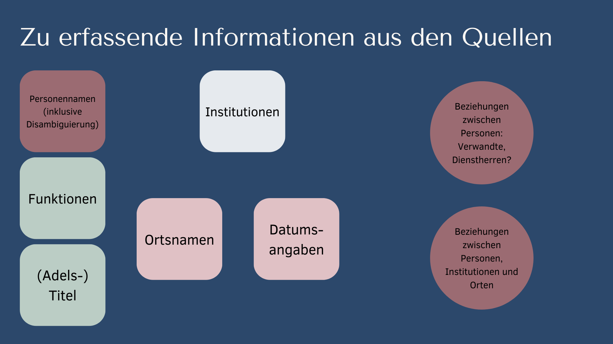
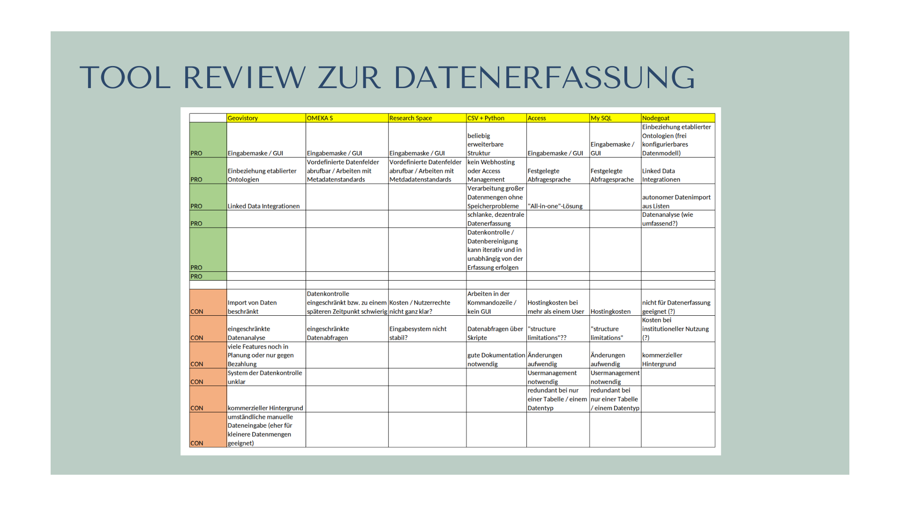

<h2>Mobilität und multiple Zugehörigkeiten von Funktionsträgern</h2>

Die Fallstudie Kurmainz zeigt beispielhaft, wie Mobilität und multiple Zugehörigkeiten von Personen (in diesem Fall: Funktionsträgern) aus diversen Daten modelliert werden können. Datenmodellierung ist eine strukturierte Aufbereitung von Daten in maschinenlesbare Form, die eine automatisierte Abfrage und Visualisierung der Daten (z.B. über Datenbankabfragen mit <a href="https://en.wikipedia.org/wiki/SQL">SQL</a> oder <a href="https://en.wikipedia.org/wiki/SPARQL">SPARQL</a>) erlaubt.

<h3>Zielsetzungen der Datenmodellierung in historischen Projekten</h3>

Idealerweise beginnt Datenmodellierung bereits mit der ersten Erfassung von Metadaten und setzt sich dann im gesammten Projekt fort. Im DigiKAR Projekt, das interdisziplinär angelegt ist und Forschende an verschiedenen Standorten verbindet, ist kontinuierliche und kollaborative Datenmodellierung auch Teil der Verständigung im Projekt. Damit verbunden ist auch die Zielsetzung, die Daten klar beschreiben und anderen Projekten zur Nachnutzung zur Verfügung stellen zu können.

Außerdem ist Datenmodellierung nicht nur dann notwendig, wenn im Projekt eine Datenbank mit graphischem Interface (d.h. Benutzeroberfläche) gebaut werden soll. Auch für Datenabfragen allein mit Excel-Filtern oder Skripten (z.B. in Python) ist die Strukturierung und (teilweise) Normalisierung von Daten notwendig. In historischen Projekten ist dies oft eine besondere Herausforderungen, da nur wenige Daten bereits seriell vorliegen und viele Quellen nicht digitalisiert wurden.

<h3>Fallstudie Kurmainz: Quellentypen und Möglichkeiten ihrer strukturierten Auswertung</h3>

Zur Analyse (biographischer) Mobilität in Kurmainz haben wir die folgenden Quellentypen ausgewertet, die auch für andere frühneuzeitliche Projekte relevant sein können:

<ul>
  <li>handschriftliche Archivquellen</li>
<li>semi-strukturierte Zusammenfassungen von Quellen (mit Schreibmaschine geschriebene Universitätsmatrikeln)</li>
  <li>in XML strukturierte biographische Daten (Professoren-API der JGU)</li>
  <li>gedruckte Quellen (Staatskalender)</li>
</ul>

Für die Extraktion und Aufbereitung relevanter Daten aus diesen Quellen sind verschiedene Strategien erforderlich, die wir u.a. in den folgenden Beiträgen beschrieben haben:

<ul>
  <li><a href="https://insulae.hypotheses.org/485">Reading historical maps with optical character recognition (OCR)</a></li>
  <li><a href="https://insulae.hypotheses.org/333">Disambiguating people and places in dirty historical data</a></li>
  <li>siehe Jupyter-Notebooks und Code-Beschreibungen in diesem Github Repositirum</li>
  <li>???</li>
</ul>

Die folgende Graphik fasst die Herangehensweise zusammen:

<h3>Vor- und Nachteile des Tabellenmodells zur Datenerfassung im DigiKAR Arbeitspaket Kurmainz</h3>

Um diese Daten für die computergestützte Aufbereitung verfügbar zu machen, haben wir uns in DigiKAR für eine Strukturierung in Tabellenformat entschieden. Eine Tabelle erlaubt bereits, Daten zueinander in klare Beziehungen zu setzen. Alternativ wäre eine Strukturierung in einem Triple-Format (vgl. <a href="https://en.wikipedia.org/wiki/Turtle_(syntax)">Turtle Syntax</a> möglich gewesen, aber wir haben uns besonders im Arbeitspaket Kurmainz bewusst für ein ereignisorientiertes Tabellenmodell entschieden, dessen Spalten die folgenden Überschriften haben:

| factoid_ID | pers_ID | event_date | event_after-date | event_before-date | event_start | event_end | event_type | pers_name | pers_title | pers_function | place_name | inst_name | rel_pers | alternative_names | source_quotations | additional_info | comment | source | source_site | info_dump |
|------------|---------|------------|------------------|-------------------|-------------|-----------|------------|-----------|------------|---------------|------------|-----------|----------|-------------------|-------------------|-----------------|---------|--------|-------------|-----------|

Dieses Tabellenmodell folgt dem <a href="https://digikar.eu/wp-content/uploads/2021/09/Poster-Factoid-approach-e1634564760183.png">Factoid-Ansatz</a> und hat folgende Eigenschaften:

<ul>
<li>hohe Quellennähe</li>
<li>Redundanz (dieselben Ereignisse können abhängig von der Quellenlage mehrmals erfasst werden)</li>
<li>vergleichweise wenige Tabellenspalten, dafür aber viele Zeilen (sh. Redundanz der Ereignisse)</li>
<li>Ereignisorientierung</li>
<li>Datenunsicherheit wird für alle Factoide angenommen und nur in wenigen Fällen zusätzlich ausgewiesen</li>
</ul>

Das Problem, Unsicherheiten nicht vollständig erfassen zu können, wurde durch die folgenden Ansätze gelöst:

<ul>
<li>Teils Klammern und Fragezeichen als bewusste Ergänzung hinter Orten (zur Dokumentation der Konventionen sh. <a href="../main/OntologyFiles" target="_blank">Ontologie Master Datei mit ausführlichen Kommentaren von Florian Stabel</a>)</li>
<li>viele Quellentypen (z.B. die Universitätsmatrikeln, die selbst eine sekundäre Quelle sind) werden generell als unsicher behandelt</li>
<li>Hierarchie der Vertrauenswürdigkeit: höchste Qualität wird eigener Erfassung aus Primärquellen zugeschrieben</li>
<li>Datenkonflikte werden durch bewusste Mehrfachnennung von Ereignissen abgebildet</li>
</ul>

Die Aufbereitung der Daten erfolgte ausschließlich via Excel und Python, um nicht von (kommerzieller) Datenbanksoftware abhängig zu sein und in allen Phasen des Projekts Roh-Daten zu generieren, die andere Projekte ebenfalls ohne Datenbanken nachnützen können (sog. <em>No DB Modell</em>):

Herausforderungen der Datenorganisation besonders in geisteswissenschaftlichen Projekten, die sich oft den Aufbau und Erhalt einer Datenbank nicht leisten können, hat Monika Barget in einem <a href="https://fasos-research.nl/mosahistoria/blog/">Beitrag für den Mosa Historia Blog der Geschichtsfakultät Maastricht</a> in englischer Sprache näher erklärt. Auf ein graphisches Interface wurde in AP3 Kurmainz verzichtet, da die erfassenden Historiker vor allem Filter in Excel genutzt haben. In AP2 wurde hingegen stärker über die Erstellung einer Eingabemaske nachgedacht.

  
<h3>Konkrete Schritte der Ontologie-Entwicklung (Best Practices)</h3>

Um die in EXCEL grundständig geordneten Daten komplex (d.h. über mehrere Spalten hinweg) abfragen zu können, war allerdings über die Entwicklung eines Eingabeformats hinaus auch die Entwicklung eines kontrollierten Vokabulars und eine Hierarchisierung bzw. logische Zuordnung von Begriffen zueinander notwendig. Diese Zuordnung von Begriffen übernehmen sogenannte Ontologien, von denen CIDOC-CRM eine der in den Geisteswissenschaften geläufigste ist. Viele Begriffe, die für die Arbeit mit historischen Ortsdaten wichtig sind, sind bereits in CIDOC-CRM angelegt, weshalb diese Ontologie eine Basis bildet, die projektbezogen erweitert werden kann. Die Ontologie legt z.B. bereits fest, wie sich akademische Titel aufeinander beziehen: bevor man Professor wird, muss man promovieren etc.

In der speziellen Arbeit in AP3 haben wir uns sowohl an CIDOC-CRM orientiert, als auch einige eigene Entscheidungen getroffen, um die Daten möglichst schlank und flexibel zu beschreiben. Entscheidungen haben wir in den sog. Ontologie-Listen des AP3 festgehalten. Dies sind Tabellen, die alle in den QUellen vorhandenen Originalbegriffe zunächst einer Kategorie Person, Ort, Institution, FUnktion oder Titel zuordnen und dann festlegen, auf welche normalisierte Bezeichnung diese Begriffe "gemappt" werden sollen. Es wurde auch in einer separaten Spalte dokumentiert, weshalb diese Entscheidungen getroffen wurden.

Das Anlegen von Ontologie-Listen dieser Art ist einerseits eine wichtige Dokumentation für die Transparenz des Forschungsprojekts, anderseits können diese Listen auch konkret zur Datenbereinigung von neu erfassten Daten dienen (vgl. dazu auch Video XXXXX).

Der aktuellste Stand der Ontologie-Listen für das Arbeitspaket Kurmainz in DigiKAR wurde hier auch GITHUB geteilt:

<a href="../main/OntologyFiles" target="_blank">Ontology Files</a>
                                                                                 
<h3>Empfehlungen für Historiker*innen für die grundlegende Datenerfassung ohne Datenbank</h3>
<strong>TEXT</strong>   
                                                                                 
<h3>Empfehlungen für die Arbeitsteilung zwischen Historiker*innen und Informationswissenschaftler*innen bzw. DB-Entwickler*innen</h3>
<strong>Tipps dazu, welche Modellierung auf der Erfassungsseite passieren sollte, und was aber die Abfrage geregelt werden kann, wenn es eine relationale DB und / oder eine Graph DB gibt.</strong>   
                                         
<h3>Kritik verschiedener Datenbankmodelle für das Arbeiten mit historischen Ortsdaten</h3>

Insgesamt haben wir uns kritisch mit Datenbankmodellen befasst...

 
                                                                                 
                                                                                 
                                                                                 
